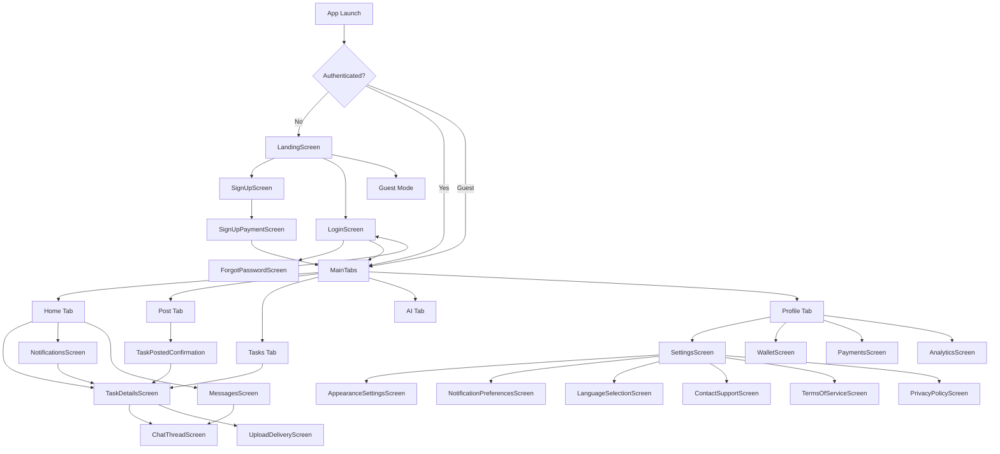

# AssignMint - Complete Screens & Navigation Wireframe Guide

**For Android Developer** - Visual guide to all screens and how they connect

---

## 📱 **App Navigation Overview**

```
Start App
    ↓
Check Auth State
    ↓
    ├─→ Not Logged In → AUTH FLOW
    └─→ Logged In/Guest → MAIN APP
```

---

## 🔐 **AUTH FLOW (Not Authenticated)**

### Navigation Tree

```
LandingScreen (Entry Point)
├─→ SignUpScreen
│   └─→ SignUpPaymentScreen (optional)
│       └─→ MainTabs (after signup)
│
├─→ LoginScreen
│   ├─→ ForgotPasswordScreen
│   │   └─→ Back to LoginScreen
│   └─→ MainTabs (after login)
│
└─→ MainTabs (guest mode)
```

### Screen Details

#### 1️⃣ **LandingScreen**
**File:** `src/screens/LandingScreen.tsx`

**Purpose:** First screen users see - app introduction and CTA

**Buttons/Actions:**
- **"Sign Up"** → Navigate to `SignUpScreen`
- **"Log In"** → Navigate to `LoginScreen`
- **"Continue as Guest"** → Navigate to `MainTabs` (guest mode)

**UI Elements:**
- App logo and branding
- Welcome message
- Three CTA buttons
- App screenshots/features

---

#### 2️⃣ **SignUpScreen**
**File:** `src/screens/SignUpScreen.tsx`

**Purpose:** User registration form

**Form Fields:**
- Full Name (text input)
- Email (email input)
- Password (secure text input)
- Confirm Password (secure text input)
- Terms & Conditions (checkbox)

**Buttons/Actions:**
- **"Create Account"** → Navigate to `SignUpPaymentScreen` OR `MainTabs`
- **"Back"** → Return to `LandingScreen`
- **"Already have account?"** → Navigate to `LoginScreen`

**Validation:**
- Email format check
- Password strength (min 8 chars)
- Passwords match
- Terms accepted

**Firebase Action:**
- Creates user in Firebase Auth
- Creates user document in Firestore `users/{uid}`

---

#### 3️⃣ **LoginScreen**
**File:** `src/screens/LoginScreen.tsx`

**Purpose:** User authentication

**Form Fields:**
- Email (email input)
- Password (secure text input)

**Buttons/Actions:**
- **"Log In"** → Navigate to `MainTabs`
- **"Forgot Password?"** → Navigate to `ForgotPasswordScreen`
- **"Don't have account?"** → Navigate to `SignUpScreen`
- **"Back"** → Return to `LandingScreen`

**Firebase Action:**
- Signs in with Firebase Auth
- Loads user data from Firestore

---

#### 4️⃣ **ForgotPasswordScreen**
**File:** `src/screens/ForgotPasswordScreen.tsx`

**Purpose:** Password reset flow

**Form Fields:**
- Email (email input)

**Buttons/Actions:**
- **"Send Reset Link"** → Email sent, show success message
- **"Back to Login"** → Navigate to `LoginScreen`

**Firebase Action:**
- Sends password reset email via Firebase Auth

---

## 🏠 **MAIN APP (Authenticated/Guest Mode)**

### Bottom Tab Navigation

```
MainTabs (Bottom Navigation)
├─→ Home Tab (HomeStack)
├─→ Post Tab (PostStack)
├─→ Tasks Tab (MyTasksStack)
├─→ AI Tab (AIStack)
└─→ Profile Tab (ProfileStack)
```

---

## 🏠 **HOME TAB**

### Navigation Tree

```
HomeScreen (Tab Root)
├─→ TaskDetailsScreen
│   ├─→ ChatThreadScreen
│   └─→ UploadDeliveryScreen
│
├─→ NotificationsScreen
│   └─→ TaskDetailsScreen (from notification)
│
└─→ MessagesScreen
    └─→ ChatThreadScreen
```

### Screen Details

#### 🏠 **HomeScreen**
**File:** `src/screens/HomeScreen.tsx`

**Purpose:** Browse available tasks (marketplace feed)

**UI Sections:**
- Search bar (filter tasks)
- Filter chips (subject, price, urgency)
- Task cards (scrollable list)
- Notification icon (badge with count)
- Messages icon (badge with count)

**Task Card Shows:**
- Task title
- Subject tag
- Price
- Deadline
- Urgency indicator
- Brief description
- Posted by (user name)

**Buttons/Actions:**
- **Tap Task Card** → Navigate to `TaskDetailsScreen` with `{taskId}`
- **Notification Icon** → Navigate to `NotificationsScreen`
- **Messages Icon** → Navigate to `MessagesScreen`
- **Search** → Filter tasks in real-time
- **Filter** → Open filter modal

**Data Source:**
- Firestore: `tasks` collection
- Query: `status == 'open'`, ordered by `createdAt desc`
- Real-time listener for live updates

---

#### 📄 **TaskDetailsScreen**
**File:** `src/screens/TaskDetailsScreen.tsx`

**Purpose:** View full task details and take actions

**Receives:**
- `taskId: string` (navigation param)
- `task?: object` (optional, for performance)

**UI Sections:**
- Task title and description
- Subject, price, deadline, urgency
- Posted by (user info)
- Attached files (if any)
- Status indicator
- Action buttons (depends on user role)

**Action Buttons (If Requester - Task Owner):**
- **"Cancel Task"** → Cancel task, update status
- **"View Applicants"** → Show list of helpers who applied
- **"Chat"** → Navigate to `ChatThreadScreen`

**Action Buttons (If Helper):**
- **"Claim Task"** → Claim task, update status to `in_progress`
- **"Upload Delivery"** → Navigate to `UploadDeliveryScreen`
- **"Chat"** → Navigate to `ChatThreadScreen`

**Navigates To:**
- `ChatThreadScreen` - params: `{chatId, taskId, otherUserId}`
- `UploadDeliveryScreen` - params: `{taskId}`

**Data Source:**
- Firestore: `tasks/{taskId}` document
- Real-time listener for status changes

---

#### 💬 **ChatThreadScreen**
**File:** `src/screens/ChatThreadScreen.tsx`

**Purpose:** Real-time messaging for a task

**Receives:**
- `chat: {id, name, taskTitle}` (navigation param)

**UI Sections:**
- Header (other user name, task title)
- Message list (scrollable, newest at bottom)
- Text input
- Send button
- File attachment button (optional)

**Message Types:**
- Text messages
- System messages (task claimed, completed, etc.)
- File attachments (future)

**Buttons/Actions:**
- **Type & Send** → Send message to Firestore
- **Tap Task Title** → Navigate to `TaskDetailsScreen`

**Data Source:**
- Firestore: `chats/{chatId}/messages` subcollection
- Real-time listener for instant message delivery

---

#### 🔔 **NotificationsScreen**
**File:** `src/screens/NotificationsScreen.tsx`

**Purpose:** View all notifications

**UI Sections:**
- Notification list (grouped by date)
- Unread count badge
- Mark all as read button

**Notification Types:**
- **Task Claimed** → Someone claimed your task
- **Task Completed** → Helper submitted work
- **Message Received** → New chat message
- **Payment Received** → Payment released

**Each Notification Shows:**
- Icon (based on type)
- Title
- Description
- Timestamp
- Read/unread indicator

**Buttons/Actions:**
- **Tap Notification** → Navigate to related screen:
  - Task notification → `TaskDetailsScreen`
  - Message notification → `ChatThreadScreen`
  - Payment notification → `WalletScreen`
- **Mark as Read** → Update Firestore

**Data Source:**
- Firestore: `notifications` collection
- Query: `userId == currentUser.uid`, ordered by `createdAt desc`
- Real-time listener

---

#### 💬 **MessagesScreen**
**File:** `src/screens/MessagesScreen.tsx`

**Purpose:** List all chat conversations

**UI Sections:**
- Chat conversation cards
- Unread count badges
- Last message preview

**Each Chat Card Shows:**
- Other user name
- Task title
- Last message text
- Last message timestamp
- Unread indicator

**Buttons/Actions:**
- **Tap Chat** → Navigate to `ChatThreadScreen` with chat details

**Data Source:**
- Firestore: `chats` collection
- Query: `participants array-contains currentUser.uid`
- Ordered by: `updatedAt desc`

---

## ➕ **POST TAB**

### Navigation Tree

```
PostTaskScreen (Tab Root - Multi-Step Wizard)
Step 1: Basic Info
Step 2: Details & Files
Step 3: Pricing
Step 4: Matching Preference
Step 5: Review & Post
    └─→ TaskPostedConfirmation
        ├─→ TaskDetailsScreen (view your task)
        └─→ Home Tab (browse more)
```

### Screen Details

#### ➕ **PostTaskScreen**
**File:** `src/screens/PostTaskScreen.tsx`

**Purpose:** Create new task (multi-step wizard)

**Step 1 - Basic Info:**
- Task title (text input)
- Subject (dropdown: Math, CS, English, etc.)
- Deadline (date/time picker)

**Step 2 - Details:**
- Description (multiline text)
- Special instructions (optional text)
- Upload files (file picker)
- Estimated hours (number input)

**Step 3 - Pricing:**
- Budget amount ($)
- Urgency level (low/medium/high)

**Step 4 - Matching:**
- Auto-match (AI finds helper)
- Manual match (browse helpers yourself)

**Step 5 - Review:**
- Summary of all fields
- Edit buttons for each section
- Final "Post Task" button

**Buttons/Actions:**
- **"Next"** → Go to next step
- **"Back"** → Go to previous step
- **"Post Task"** → Create task in Firestore, navigate to confirmation

**Firebase Action:**
- Creates document in `tasks` collection
- Uploads files to Firebase Storage
- Sends notification to potential helpers (if auto-match)

**Navigates To:**
- `TaskPostedConfirmation` - params: `{taskId, taskTitle, budget, matchingType}`

---

#### ✅ **TaskPostedConfirmation**
**File:** `src/screens/TaskPostedConfirmation.tsx`

**Purpose:** Success screen after posting task

**UI Elements:**
- Success checkmark animation
- "Task Posted Successfully!"
- Task details summary
- What happens next info

**Buttons/Actions:**
- **"View My Task"** → Navigate to `TaskDetailsScreen`
- **"Browse Tasks"** → Navigate to Home Tab
- **"Post Another"** → Reset form, stay on Post Tab

---

## 📋 **MY TASKS TAB**

### Navigation Tree

```
MyTasksScreen (Tab Root)
├─→ TaskDetailsScreen
│   ├─→ ChatThreadScreen
│   └─→ UploadDeliveryScreen
│
└─→ Filters: Posted | Claimed | Completed
```

### Screen Details

#### 📋 **MyTasksScreen**
**File:** `src/screens/MyTasksScreen.tsx`

**Purpose:** View tasks you posted or claimed

**UI Sections:**
- Filter tabs (Posted | Claimed | Completed)
- Task list (filtered by selected tab)
- Empty state (if no tasks)

**Posted Tasks (Tasks You Created):**
- Shows: title, status, price, deadline
- Status: open, in_progress, completed, cancelled
- Action: Tap to view details

**Claimed Tasks (Tasks You're Working On):**
- Shows: title, requester name, deadline, payment
- Action: Tap to deliver or chat

**Completed Tasks:**
- Shows: title, final price, completion date
- Read-only view

**Buttons/Actions:**
- **Tap Task** → Navigate to `TaskDetailsScreen`
- **Filter Tabs** → Change displayed tasks

**Data Source:**
- Firestore queries:
  - Posted: `createdBy == currentUser.uid`
  - Claimed: `completedBy == currentUser.uid`
  - Filter by status

---

#### 📤 **UploadDeliveryScreen**
**File:** `src/screens/UploadDeliveryScreen.tsx`

**Purpose:** Submit completed work for a task

**Receives:**
- `taskId: string` (navigation param)

**UI Sections:**
- Task details (read-only)
- Delivery message (text area)
- File upload (multiple files)
- Upload progress indicators

**Form Fields:**
- Completion notes (required text)
- Attach files (optional)

**Buttons/Actions:**
- **"Upload Files"** → Open file picker
- **"Submit Delivery"** → Upload to Storage, update task status
- **"Cancel"** → Go back

**Firebase Actions:**
- Upload files to Firebase Storage: `tasks/{taskId}/deliverables/`
- Update task status to `submitted`
- Create notification for task owner
- Update task document with file URLs

**On Success:**
- Navigate back to `TaskDetailsScreen`
- Show success message

---

## 🤖 **AI TAB**

### Navigation Tree

```
AIAssistantScreen (Tab Root)
└─→ Can suggest tasks → Navigate to TaskDetailsScreen
```

### Screen Details

#### 🤖 **AIAssistantScreen**
**File:** `src/screens/AIAssistantScreen.tsx`

**Purpose:** AI-powered task assistance

**UI Sections:**
- Chat interface
- AI responses
- Suggested tasks (cards)
- Chat history

**Features:**
- Ask AI about task help
- Get task recommendations
- Homework tips
- Subject assistance

**Buttons/Actions:**
- **Send Message** → Chat with AI
- **Tap Suggested Task** → Navigate to `TaskDetailsScreen`

**Data Source:**
- Firestore: `aiSessions` collection (chat history)
- AI API calls for responses

---

## 👤 **PROFILE TAB**

### Navigation Tree

```
ProfileScreen (Tab Root)
├─→ SettingsScreen
│   ├─→ AppearanceSettingsScreen
│   ├─→ NotificationPreferencesScreen
│   ├─→ LanguageSelectionScreen
│   ├─→ DownloadPreferencesScreen
│   ├─→ BetaFeaturesScreen
│   ├─→ AddPaymentMethodScreen
│   ├─→ ContactSupportScreen
│   ├─→ TermsOfServiceScreen
│   └─→ PrivacyPolicyScreen
│
├─→ WalletScreen
│   └─→ Transaction details
│
├─→ PaymentsScreen
│   └─→ AddPaymentMethodScreen
│
└─→ AnalyticsScreen
    └─→ View your stats
```

### Screen Details

#### 👤 **ProfileScreen**
**File:** `src/screens/ProfileScreen.tsx`

**Purpose:** User profile and settings hub

**UI Sections:**
- **Profile Header:**
  - Avatar
  - Display name
  - Rating (⭐ x.x)
  - Trust score

- **Stats Cards:**
  - Tasks Posted
  - Tasks Completed
  - Total Earned
  - Success Rate

- **Menu Items:**
  - Settings
  - Wallet
  - Payment Methods
  - Analytics
  - Help & Support
  - Terms of Service
  - Privacy Policy
  - Logout

**Buttons/Actions:**
- **Settings** → Navigate to `SettingsScreen`
- **Wallet** → Navigate to `WalletScreen`
- **Payments** → Navigate to `PaymentsScreen`
- **Analytics** → Navigate to `AnalyticsScreen`
- **Support** → Navigate to `ContactSupportScreen`
- **Terms** → Navigate to `TermsOfServiceScreen`
- **Privacy** → Navigate to `PrivacyPolicyScreen`
- **Logout** → Sign out, navigate to `LandingScreen`

**Data Source:**
- Firestore: `users/{uid}` document
- Firestore: `wallets/{uid}` for balance
- Firestore: `tasks` for stats calculations

---

#### ⚙️ **SettingsScreen**
**File:** `src/screens/SettingsScreen.tsx`

**Purpose:** App settings and preferences

**Menu Sections:**

**Appearance:**
- **Appearance Settings** → `AppearanceSettingsScreen`

**Notifications:**
- **Notification Preferences** → `NotificationPreferencesScreen`

**Language & Region:**
- **Language Selection** → `LanguageSelectionScreen`
- **Download Preferences** → `DownloadPreferencesScreen`

**Advanced:**
- **Beta Features** → `BetaFeaturesScreen`

**Account:**
- **Payment Methods** → `AddPaymentMethodScreen`

**Support:**
- **Contact Support** → `ContactSupportScreen`
- **Terms of Service** → `TermsOfServiceScreen`
- **Privacy Policy** → `PrivacyPolicyScreen`

---

#### 💰 **WalletScreen**
**File:** `src/screens/WalletScreen.tsx`

**Purpose:** View balance and transactions

**UI Sections:**
- **Balance Card:**
  - Available Balance ($)
  - Pending Balance (in escrow)
  - Total Earnings
  
- **Quick Actions:**
  - Withdraw
  - Add Funds
  - Payment Settings

- **Transaction History:**
  - List of all transactions
  - Type (credit/debit)
  - Amount, date, description

**Buttons/Actions:**
- **"Withdraw"** → Initiate withdrawal
- **"Add Funds"** → Add money to wallet
- **Tap Transaction** → View transaction details

**Data Source:**
- Firestore: `wallets/{uid}` for balances
- Firestore: `transactions` collection filtered by userId

---

#### 💳 **PaymentsScreen**
**File:** `src/screens/PaymentsScreen.tsx`

**Purpose:** Manage payment methods

**UI Sections:**
- Saved payment methods (cards)
- Add new payment method button
- Default payment indicator

**Buttons/Actions:**
- **"Add Payment Method"** → Navigate to `AddPaymentMethodScreen`
- **"Remove"** → Delete payment method
- **"Set as Default"** → Update default payment

**Integration:**
- Stripe API for payment methods
- Firestore for saving references

---

## 📊 **Complete Navigation Map**

### Visual Flow Diagram



---

## 📋 **Complete Screen Registry**

| # | Screen Name | File | Tab/Stack | Main Action |
|---|-------------|------|-----------|-------------|
| 1 | Landing | `LandingScreen.tsx` | Auth | Sign up / Login / Guest |
| 2 | Sign Up | `SignUpScreen.tsx` | Auth | Create account |
| 3 | Login | `LoginScreen.tsx` | Auth | Authenticate |
| 4 | Forgot Password | `ForgotPasswordScreen.tsx` | Auth | Reset password |
| 5 | Sign Up Payment | `SignUpPaymentScreen.tsx` | Auth | Add payment (optional) |
| 6 | Home | `HomeScreen.tsx` | Home Tab | Browse tasks |
| 7 | Task Details | `TaskDetailsScreen.tsx` | Stack | View/claim/manage task |
| 8 | Chat Thread | `ChatThreadScreen.tsx` | Stack | Real-time messaging |
| 9 | Upload Delivery | `UploadDeliveryScreen.tsx` | Stack | Submit completed work |
| 10 | Notifications | `NotificationsScreen.tsx` | Stack | View notifications |
| 11 | Messages | `MessagesScreen.tsx` | Stack | Chat list |
| 12 | Post Task | `PostTaskScreen.tsx` | Post Tab | Create new task |
| 13 | Task Posted | `TaskPostedConfirmation.tsx` | Stack | Success confirmation |
| 14 | My Tasks | `MyTasksScreen.tsx` | Tasks Tab | Your tasks |
| 15 | AI Assistant | `AIAssistantScreen.tsx` | AI Tab | AI chat helper |
| 16 | Profile | `ProfileScreen.tsx` | Profile Tab | User profile hub |
| 17 | Settings | `SettingsScreen.tsx` | Stack | App settings |
| 18 | Wallet | `WalletScreen.tsx` | Stack | Balance & transactions |
| 19 | Payments | `PaymentsScreen.tsx` | Stack | Payment methods |
| 20 | Analytics | `AnalyticsScreen.tsx` | Stack | User stats |
| 21 | Appearance Settings | `AppearanceSettingsScreen.tsx` | Stack | Theme & display |
| 22 | Notification Prefs | `NotificationPreferencesScreen.tsx` | Stack | Notification settings |
| 23 | Language | `LanguageSelectionScreen.tsx` | Stack | Choose language |
| 24 | Download Prefs | `DownloadPreferencesScreen.tsx` | Stack | Download settings |
| 25 | Beta Features | `BetaFeaturesScreen.tsx` | Stack | Experimental features |
| 26 | Add Payment | `AddPaymentMethodScreen.tsx` | Stack | Add card/payment |
| 27 | Contact Support | `ContactSupportScreen.tsx` | Stack | Help & support |
| 28 | Terms | `TermsOfServiceScreen.tsx` | Stack | Legal terms |
| 29 | Privacy | `PrivacyPolicyScreen.tsx` | Stack | Privacy policy |

---

## 🔄 **Common User Flows**

### Flow 1: Post a Task (Requester)
```
1. Tap "Post" tab
2. PostTaskScreen - Fill wizard (5 steps)
3. Tap "Post Task"
4. TaskPostedConfirmation appears
5. Tap "View My Task"
6. TaskDetailsScreen shows your task
7. Wait for helper to claim
8. Get notification when claimed
9. Chat with helper
10. Receive delivery
11. Approve and release payment
```

### Flow 2: Complete a Task (Helper)
```
1. Home tab - Browse tasks
2. Tap task card
3. TaskDetailsScreen - View details
4. Tap "Claim Task"
5. Task status changes to "in_progress"
6. Work on assignment
7. Tap "Upload Delivery"
8. UploadDeliveryScreen - Upload files and notes
9. Tap "Submit"
10. Task status changes to "submitted"
11. Wait for requester approval
12. Payment released to wallet
```

### Flow 3: Messaging Flow
```
1. TaskDetailsScreen - Tap "Chat"
   OR
   Home screen - Tap Messages icon
   
2. MessagesScreen - See all chats
3. Tap chat conversation
4. ChatThreadScreen - Send/receive messages
5. Real-time updates appear instantly
```

### Flow 4: Check Notifications
```
1. Home screen - Tap Notification icon
2. NotificationsScreen - View all notifications
3. Tap notification
4. Navigate to relevant screen (Task/Chat/etc.)
```

---

## 🎨 **Screen Type Legend**

| Type | Description | Back Button | Example |
|------|-------------|-------------|---------|
| **Tab Screen** | Bottom tab navigation | None (disabled) | HomeScreen, ProfileScreen |
| **Stack Screen** | Pushed on navigation stack | Yes (default) | TaskDetailsScreen, ChatThreadScreen |
| **Modal** | Overlays current screen | X close button | FilterModal (future) |
| **Wizard** | Multi-step form | Back between steps | PostTaskScreen |

---

## 🔗 **Screen Connections Summary**

### **Most Connected Screens:**

**TaskDetailsScreen** (Hub - connects to many screens):
- ← From: HomeScreen, MyTasksScreen, NotificationsScreen, AIAssistantScreen
- → To: ChatThreadScreen, UploadDeliveryScreen

**HomeScreen** (Main entry point):
- → To: TaskDetailsScreen, NotificationsScreen, MessagesScreen

**ProfileScreen** (Settings hub):
- → To: SettingsScreen, WalletScreen, PaymentsScreen, AnalyticsScreen

---

## 📐 **Navigation Implementation**

### File Structure:
```
src/navigation/
├── RootNavigator.tsx      # Top-level (Auth vs Main)
├── AuthNavigator.tsx      # Auth screens stack
├── AppTabs.tsx            # Bottom tabs
├── stacks/
│   ├── HomeStack.tsx      # Home tab stack
│   ├── PostStack.tsx      # Post tab stack
│   ├── MyTasksStack.tsx   # Tasks tab stack
│   ├── AIStack.tsx        # AI tab stack
│   └── ProfileStack.tsx   # Profile tab stack
└── types.ts               # TypeScript navigation types
```

### Navigation Pattern:
```typescript
// Navigate to screen
navigation.navigate('TaskDetails', { taskId: '123' });

// Go back
navigation.goBack();

// Navigate and reset stack
navigation.reset({
  index: 0,
  routes: [{ name: 'Home' }],
});
```

---

## 🎯 **For Your Android Developer Friend**

### **Key Screens to Focus On:**

1. **HomeScreen** - Main task feed (needs real Firestore data)
2. **TaskDetailsScreen** - Task details and actions
3. **PostTaskScreen** - Creating tasks (Firestore writes)
4. **ChatThreadScreen** - Real-time messaging
5. **NotificationsScreen** - Push notification handling

### **Navigation They Should Understand:**

- **Tab Navigation** - Bottom tabs (Home, Post, Tasks, AI, Profile)
- **Stack Navigation** - Screens that push on top (Details, Chat, etc.)
- **Params** - How data passes between screens (`taskId`, `chatId`, etc.)

### **Firestore Connections:**

- **HomeScreen** → `tasks` collection (real-time listener)
- **TaskDetailsScreen** → `tasks/{taskId}` document
- **ChatThreadScreen** → `chats/{chatId}/messages` subcollection
- **NotificationsScreen** → `notifications` collection
- **MyTasksScreen** → `tasks` with queries (createdBy, completedBy)

---

## 📝 **Quick Reference Card**

```
AUTH SCREENS
LandingScreen → SignUpScreen → SignUpPaymentScreen → MainTabs
             → LoginScreen → MainTabs
             → Guest Mode → MainTabs (limited)

MAIN TABS
[Home] [Post] [Tasks] [AI] [Profile]

FROM HOME TAB
Home → Task Details → Chat Thread
                    → Upload Delivery
     → Notifications → Task Details
     → Messages → Chat Thread

FROM POST TAB
Post (Wizard) → Task Posted Confirmation → Task Details

FROM TASKS TAB
My Tasks → Task Details → (same as Home)

FROM PROFILE TAB
Profile → Settings → (9 sub-screens)
        → Wallet
        → Payments → Add Payment Method
        → Analytics
```

---

## 🎨 **Wireframe Simplified (ASCII)**

### Landing Screen
```
┌─────────────────────────┐
│                         │
│     [ASSIGNMINT LOGO]   │
│                         │
│   Connect Students      │
│   with Helpers          │
│                         │
│  ┌─────────────────┐   │
│  │   SIGN UP       │   │
│  └─────────────────┘   │
│                         │
│  ┌─────────────────┐   │
│  │   LOG IN        │   │
│  └─────────────────┘   │
│                         │
│    Continue as Guest    │
│                         │
└─────────────────────────┘
```

### Home Screen
```
┌─────────────────────────┐
│ 🔍 Search    🔔(3) 💬(2)│
├─────────────────────────┤
│ [Filter: All] [Math]    │
├─────────────────────────┤
│ ┌─────────────────────┐ │
│ │ Help with Calculus  │ │
│ │ Math · $25 · 2 days │ │
│ │ "Need help with..." │ │
│ │         [Claim] →   │ │
│ └─────────────────────┘ │
│ ┌─────────────────────┐ │
│ │ React Native Debug  │ │
│ │ CS · $30 · 1 day    │ │
│ │ "Firebase issue..." │ │
│ │         [Claim] →   │ │
│ └─────────────────────┘ │
│                         │
└─────────────────────────┘
   [🏠] [➕] [📋] [🤖] [👤]
```

### Task Details Screen
```
┌─────────────────────────┐
│ ← Task Details          │
├─────────────────────────┤
│ Help with Calculus      │
│ Posted by: John Doe     │
│                         │
│ Subject: Mathematics    │
│ Deadline: Dec 31        │
│ Price: $25              │
│ Urgency: ⚡ High        │
│                         │
│ Description:            │
│ "I need help solving    │
│  these derivative       │
│  problems..."           │
│                         │
│ 📎 Attachments:         │
│ • homework.pdf          │
│                         │
│ ┌─────────────────────┐ │
│ │   CLAIM THIS TASK   │ │
│ └─────────────────────┘ │
│                         │
│ ┌─────────────────────┐ │
│ │   CHAT WITH POSTER  │ │
│ └─────────────────────┘ │
│                         │
└─────────────────────────┘
```

### Chat Thread Screen
```
┌─────────────────────────┐
│ ← John Doe              │
│   Calculus Task         │
├─────────────────────────┤
│                         │
│  ┌─────────────────┐   │
│  │ Hi! I can help  │   │
│  │ with this task  │   │
│  └─────────────────┘   │
│      [Them] 2:30pm     │
│                         │
│    ┌──────────────────┐│
│    │ Great! When can ││
│    │ you start?      ││
│    └──────────────────┘│
│        [You] 2:31pm    │
│                         │
│  ┌─────────────────┐   │
│  │ Right away!     │   │
│  └─────────────────┘   │
│      [Them] 2:32pm     │
│                         │
├─────────────────────────┤
│ [Type message...]  [📎]│
│                    [📤]│
└─────────────────────────┘
```

### Profile Screen
```
┌─────────────────────────┐
│   Profile        [⚙️]   │
├─────────────────────────┤
│      [AVATAR]           │
│    John Doe             │
│    ⭐ 4.8 (24 reviews)  │
│                         │
│ ┌─────┐ ┌─────┐ ┌─────┐│
│ │  12 │ │  8  │ │ $240││
│ │Posts│ │Done │ │ Earn││
│ └─────┘ └─────┘ └─────┘│
│                         │
│ ► Settings              │
│ ► Wallet        $45.00  │
│ ► Payment Methods       │
│ ► Analytics             │
│ ► Help & Support        │
│ ► Terms of Service      │
│ ► Privacy Policy        │
│                         │
│ ┌─────────────────────┐ │
│ │   LOG OUT           │ │
│ └─────────────────────┘ │
└─────────────────────────┘
   [🏠] [➕] [📋] [🤖] [👤]
```

---

## 🎯 **Quick Reference for Developer**

### **To Add a New Screen:**
1. Create file in `src/screens/NewScreen.tsx`
2. Add to appropriate stack in `src/navigation/stacks/`
3. Add TypeScript types in `src/navigation/types.ts`
4. Test navigation with params

### **To Navigate Between Screens:**
```typescript
// From any screen
navigation.navigate('TaskDetails', { taskId: '123' });

// Go back
navigation.goBack();

// Navigate to tab
navigation.navigate('MainTabs', { screen: 'Home' });
```

### **To Pass Data:**
```typescript
// Sending screen
navigation.navigate('ChatThread', {
  chat: { id: 'chat123', name: 'John', taskTitle: 'Math Help' }
});

// Receiving screen
const { chat } = route.params;
```

---

**This guide shows ALL screens, their connections, and navigation flows. Perfect for your friend to understand the complete app structure!** 🎯

Would you like me to commit this to your repository as well?
