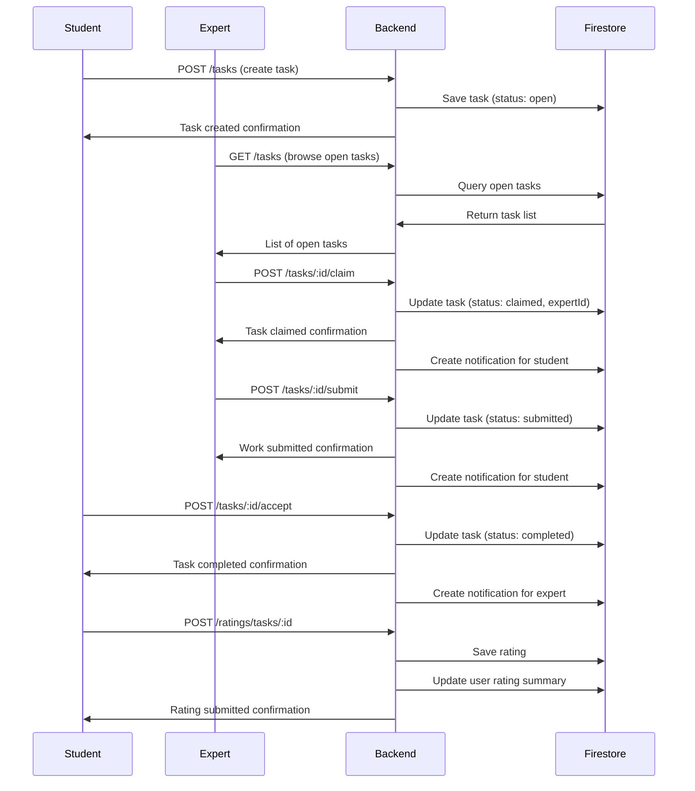
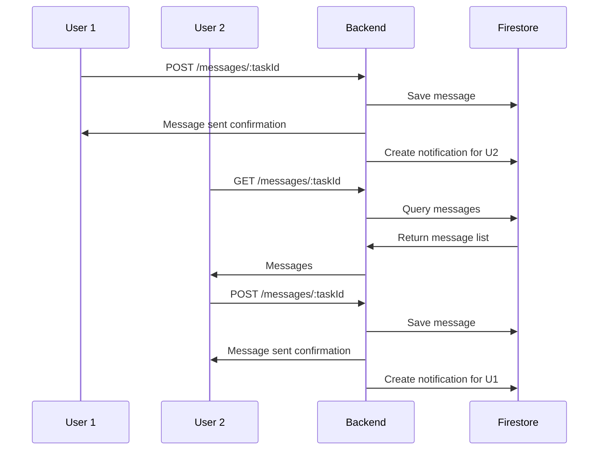

# AssignMint Core Features Documentation

## Overview

This document describes the complete core functionality of AssignMint, including the task marketplace, messaging system, ratings, user profiles, and notifications.

## Architecture

### Backend Services
- **Tasks**: Complete task lifecycle management
- **Messages**: Real-time chat for tasks
- **Ratings**: Review and rating system
- **Users**: Profile management and statistics
- **Notifications**: Real-time notification system
- **AI**: Intelligent tutoring (separate implementation)

### Database Schema
- **Firestore Collections**: tasks, taskMessages, ratings, users, notifications, taskEvents
- **Real-time Updates**: Firebase real-time listeners for live data
- **Authentication**: Firebase Auth with JWT tokens

## 1. Task Management System

### Task Lifecycle
```
Post → Claim → Submit → Accept/Reject → Complete
```

### Task Statuses
- **open**: Available for claiming
- **claimed**: Assigned to an expert
- **submitted**: Work submitted for review
- **completed**: Accepted and completed
- **rejected**: Rejected, back to claimed status

### API Endpoints

#### Create Task
```http
POST /tasks
Authorization: Bearer <firebaseIdToken>
Content-Type: application/json

{
  "title": "Help with Calculus Problem",
  "subject": "Mathematics",
  "description": "Need help solving this derivative problem...",
  "price": 25.00,
  "deadline": "2024-12-31T23:59:59Z",
  "fileUrls": ["https://example.com/file1.pdf"]
}
```

#### Get Tasks (with filters)
```http
GET /tasks?status=open&subject=math&priceMin=10&priceMax=50&sort=deadlineSoonest&page=1&limit=20
Authorization: Bearer <firebaseIdToken>
```

#### Get Task Details
```http
GET /tasks/:taskId
Authorization: Bearer <firebaseIdToken>
```

#### Claim Task
```http
POST /tasks/:taskId/claim
Authorization: Bearer <firebaseIdToken>
```

#### Submit Work
```http
POST /tasks/:taskId/submit
Authorization: Bearer <firebaseIdToken>
Content-Type: application/json

{
  "message": "Here's my solution to your problem...",
  "fileUrls": ["https://example.com/solution.pdf"]
}
```

#### Accept/Reject Submission
```http
POST /tasks/:taskId/accept
POST /tasks/:taskId/reject
Authorization: Bearer <firebaseIdToken>

# For reject, include reason:
{
  "reason": "The solution doesn't match the requirements"
}
```

### Firestore Schema

#### tasks/{taskId}
```typescript
{
  id: string;
  ownerId: string;
  expertId?: string;
  title: string;
  subject: string;
  description: string;
  price: number;
  deadline: Date;
  status: 'open' | 'claimed' | 'submitted' | 'completed' | 'rejected';
  fileUrls: string[];
  createdAt: Date;
  updatedAt: Date;
}
```

#### taskEvents/{eventId}
```typescript
{
  id: string;
  taskId: string;
  type: 'claim' | 'submit' | 'accept' | 'reject';
  userId: string;
  message: string;
  metadata?: Record<string, any>;
  createdAt: Date;
}
```

## 2. Messaging System

### Real-time Chat
- **Per-task messaging**: Each task has its own chat thread
- **Real-time updates**: Firebase real-time listeners
- **Message persistence**: All messages stored in Firestore

### API Endpoints

#### Get Task Messages
```http
GET /messages/:taskId
Authorization: Bearer <firebaseIdToken>
```

#### Send Message
```http
POST /messages/:taskId
Authorization: Bearer <firebaseIdToken>
Content-Type: application/json

{
  "text": "Hello! I have a question about this task..."
}
```

#### Delete Message
```http
DELETE /messages/:messageId
Authorization: Bearer <firebaseIdToken>
```

### Firestore Schema

#### taskMessages/{messageId}
```typescript
{
  id: string;
  taskId: string;
  senderId: string;
  text: string;
  createdAt: Date;
}
```

## 3. Ratings & Reviews System

### Rating Features
- **5-star rating system**: 1-5 stars with comments
- **One rating per task**: Users can only rate once per completed task
- **Rating aggregation**: Automatic calculation of average ratings
- **Rating distribution**: Breakdown of ratings (1-5 stars)

### API Endpoints

#### Create Rating
```http
POST /ratings/tasks/:taskId
Authorization: Bearer <firebaseIdToken>
Content-Type: application/json

{
  "rating": 5,
  "comment": "Excellent work! Very detailed solution.",
  "toUserId": "expert_user_id"
}
```

#### Get User Ratings
```http
GET /ratings/users/:userId
Authorization: Bearer <firebaseIdToken>
```

#### Get Rating Summary
```http
GET /ratings/users/:userId/summary
Authorization: Bearer <firebaseIdToken>
```

### Firestore Schema

#### ratings/{ratingId}
```typescript
{
  id: string;
  taskId: string;
  fromUserId: string;
  toUserId: string;
  rating: number; // 1-5
  comment: string;
  createdAt: Date;
}
```

## 4. User Profiles & Statistics

### Profile Features
- **Basic info**: Display name, avatar, bio
- **Subject expertise**: Array of subjects the user specializes in
- **Rating statistics**: Average rating, total ratings, rating distribution
- **Task statistics**: Posted, claimed, and completed task counts
- **Earnings tracking**: Total earnings from completed tasks

### API Endpoints

#### Get User Profile
```http
GET /users/:userId
Authorization: Bearer <firebaseIdToken>
```

#### Get Current User Profile
```http
GET /users/me/profile
Authorization: Bearer <firebaseIdToken>
```

#### Update Profile
```http
PUT /users/me/profile
Authorization: Bearer <firebaseIdToken>
Content-Type: application/json

{
  "displayName": "John Doe",
  "bio": "Expert in mathematics and physics",
  "subjects": ["Mathematics", "Physics", "Computer Science"]
}
```

#### Get User Statistics
```http
GET /users/me/stats
Authorization: Bearer <firebaseIdToken>
```

#### Search Users
```http
GET /users/search?q=john&subjects=math,physics
Authorization: Bearer <firebaseIdToken>
```

#### Get Top Rated Users
```http
GET /users/top-rated?limit=10
Authorization: Bearer <firebaseIdToken>
```

### Firestore Schema

#### users/{uid}
```typescript
{
  uid: string;
  displayName: string;
  email: string;
  avatar?: string;
  avgRating: number;
  totalRatings: number;
  completedTasks: number;
  bio?: string;
  subjects?: string[];
  createdAt: Date;
  updatedAt: Date;
}
```

## 5. Search & Filtering

### Task Filters
- **Status**: open, claimed, submitted, completed, rejected
- **Subject**: Mathematics, Computer Science, English, etc.
- **Price Range**: min/max price filters
- **Sorting**: deadlineSoonest, priceHighLow, newest

### User Search
- **Name Search**: Search by display name or bio
- **Subject Filter**: Filter by expertise subjects
- **Rating Sort**: Results sorted by average rating

### Example Queries

#### Filter Open Math Tasks
```http
GET /tasks?status=open&subject=Mathematics&priceMin=10&priceMax=100&sort=deadlineSoonest
```

#### Search Math Experts
```http
GET /users/search?q=calculus&subjects=Mathematics
```

## 6. Notification System

### Notification Types
- **task_claimed**: When someone claims your task
- **task_submitted**: When work is submitted for review
- **task_accepted**: When your work is accepted
- **task_rejected**: When your work is rejected
- **new_message**: When someone sends a message
- **rating_received**: When you receive a rating
- **deadline_reminder**: Task deadline approaching
- **system_message**: System notifications

### API Endpoints

#### Get Notifications
```http
GET /notifications?page=1&limit=20&unreadOnly=false
Authorization: Bearer <firebaseIdToken>
```

#### Get Unread Count
```http
GET /notifications/count?unreadOnly=true
Authorization: Bearer <firebaseIdToken>
```

#### Mark as Read
```http
PUT /notifications/:notificationId/read
Authorization: Bearer <firebaseIdToken>
```

#### Mark All as Read
```http
PUT /notifications/read-all
Authorization: Bearer <firebaseIdToken>
```

### Firestore Schema

#### notifications/{notificationId}
```typescript
{
  id: string;
  userId: string;
  type: NotificationType;
  taskId?: string;
  message: string;
  read: boolean;
  createdAt: Date;
}
```

## 7. Authentication & Security

### Firebase Authentication
- **JWT Tokens**: All API requests require valid Firebase ID token
- **User Validation**: Backend validates tokens and extracts user info
- **Route Protection**: All routes protected by authMiddleware

### Security Features
- **User Isolation**: Users can only access their own data
- **Input Validation**: All inputs validated with express-validator
- **Rate Limiting**: API rate limiting (100 requests per 15 minutes)
- **Error Handling**: Comprehensive error handling and logging

### Example Authentication Flow
```typescript
// Frontend: Get Firebase ID token
const token = await auth().currentUser?.getIdToken();

// Frontend: Make authenticated request
const response = await fetch('/api/tasks', {
  headers: {
    'Authorization': `Bearer ${token}`,
    'Content-Type': 'application/json'
  }
});

// Backend: Validate token in authMiddleware
const decodedToken = await auth.verifyIdToken(token);
req.user = {
  uid: decodedToken.uid,
  email: decodedToken.email,
  displayName: decodedToken.name
};
```

## 8. Frontend Integration

### API Service Layer
```typescript
// Example: Task API service
class TaskApiService {
  async createTask(taskData: CreateTaskRequest): Promise<Task> {
    const token = await this.getAuthToken();
    const response = await fetch('/api/tasks', {
      method: 'POST',
      headers: {
        'Authorization': `Bearer ${token}`,
        'Content-Type': 'application/json'
      },
      body: JSON.stringify(taskData)
    });
    return response.json();
  }
}
```

### Real-time Updates
```typescript
// Listen for real-time task updates
const unsubscribe = onSnapshot(
  query(collection(db, 'tasks'), where('status', '==', 'open')),
  (snapshot) => {
    const tasks = snapshot.docs.map(doc => ({
      id: doc.id,
      ...doc.data()
    }));
    setTasks(tasks);
  }
);
```

## 9. Example cURL Commands

### Authentication
```bash
# Get Firebase ID token (you'll need to implement this)
TOKEN="your_firebase_id_token_here"
```

### Task Operations
```bash
# Create a task
curl -X POST http://localhost:3000/tasks \
  -H "Authorization: Bearer $TOKEN" \
  -H "Content-Type: application/json" \
  -d '{
    "title": "Math Help Needed",
    "subject": "Mathematics",
    "description": "Need help with calculus",
    "price": 30.00,
    "deadline": "2024-12-31T23:59:59Z"
  }'

# Get open tasks
curl -X GET "http://localhost:3000/tasks?status=open&subject=Mathematics" \
  -H "Authorization: Bearer $TOKEN"

# Claim a task
curl -X POST http://localhost:3000/tasks/task_123/claim \
  -H "Authorization: Bearer $TOKEN"
```

### Messaging
```bash
# Send a message
curl -X POST http://localhost:3000/messages/task_123 \
  -H "Authorization: Bearer $TOKEN" \
  -H "Content-Type: application/json" \
  -d '{"text": "Hello! I can help with this task."}'

# Get task messages
curl -X GET http://localhost:3000/messages/task_123 \
  -H "Authorization: Bearer $TOKEN"
```

### Ratings
```bash
# Rate a user
curl -X POST http://localhost:3000/ratings/tasks/task_123 \
  -H "Authorization: Bearer $TOKEN" \
  -H "Content-Type: application/json" \
  -d '{
    "rating": 5,
    "comment": "Excellent work!",
    "toUserId": "user_456"
  }'
```

### User Profiles
```bash
# Get user profile
curl -X GET http://localhost:3000/users/user_123 \
  -H "Authorization: Bearer $TOKEN"

# Update own profile
curl -X PUT http://localhost:3000/users/me/profile \
  -H "Authorization: Bearer $TOKEN" \
  -H "Content-Type: application/json" \
  -d '{
    "displayName": "John Doe",
    "bio": "Expert in mathematics"
  }'
```

## 10. Flow Diagrams

### Complete Task Flow


### Messaging Flow


## 11. Error Handling

### Common Error Responses
```typescript
// Validation Error
{
  "success": false,
  "error": "Validation failed",
  "details": [
    {
      "type": "field",
      "value": "",
      "msg": "Title is required",
      "path": "title"
    }
  ]
}

// Authentication Error
{
  "success": false,
  "error": "Invalid token"
}

// Business Logic Error
{
  "success": false,
  "error": "Task is not available for claiming"
}

// Server Error
{
  "success": false,
  "error": "Failed to create task"
}
```

### Error Codes
- **400**: Bad Request (validation errors)
- **401**: Unauthorized (invalid/missing token)
- **403**: Forbidden (insufficient permissions)
- **404**: Not Found (resource doesn't exist)
- **500**: Internal Server Error (server issues)

## 12. Performance Considerations

### Database Optimization
- **Indexes**: Create composite indexes for common queries
- **Pagination**: Limit results and implement cursor-based pagination
- **Caching**: Consider Redis for frequently accessed data

### Real-time Updates
- **Selective Listening**: Only listen to relevant collections
- **Batch Updates**: Use Firestore batch operations for multiple updates
- **Connection Management**: Properly manage Firebase connections

## 13. Testing

### API Testing
```bash
# Test health endpoint
curl http://localhost:3000/health

# Test authentication
curl -X GET http://localhost:3000/tasks \
  -H "Authorization: Bearer invalid_token"
# Should return 401
```

### Integration Testing
- Test complete task flow from creation to completion
- Verify real-time updates work correctly
- Test error scenarios and edge cases

## 14. Deployment

### Environment Variables
```bash
# Required
FIREBASE_PROJECT_ID=your-project-id
FIREBASE_PRIVATE_KEY=your-private-key
FIREBASE_CLIENT_EMAIL=your-client-email
FIREBASE_STORAGE_BUCKET=your-bucket

# Optional
PORT=3000
NODE_ENV=production
LOG_LEVEL=info
```

### Firestore Rules
```javascript
// Example security rules
rules_version = '2';
service cloud.firestore {
  match /databases/{database}/documents {
    // Users can only read/write their own data
    match /users/{userId} {
      allow read, write: if request.auth != null && request.auth.uid == userId;
    }
    
    // Tasks: owners and experts can read/write
    match /tasks/{taskId} {
      allow read: if request.auth != null;
      allow create: if request.auth != null;
      allow update: if request.auth != null && 
        (resource.data.ownerId == request.auth.uid || 
         resource.data.expertId == request.auth.uid);
    }
  }
}
```

## Conclusion

This implementation provides a complete, production-ready foundation for the AssignMint marketplace. The system handles the full task lifecycle, real-time communication, user management, and provides a robust API for frontend integration.

Key strengths:
- **Comprehensive**: Covers all core marketplace functionality
- **Scalable**: Built with Firebase for scalability
- **Secure**: Proper authentication and authorization
- **Real-time**: Live updates for better user experience
- **Well-documented**: Clear API documentation and examples

The system is ready for frontend integration and can be extended with additional features like payment processing, dispute resolution, and advanced analytics.
