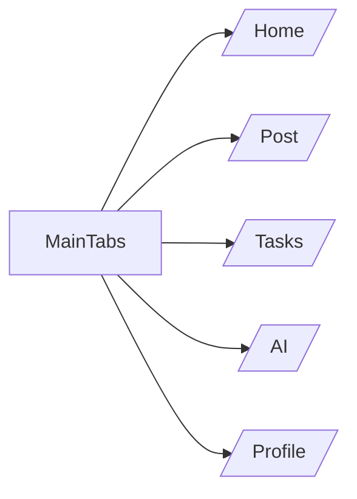
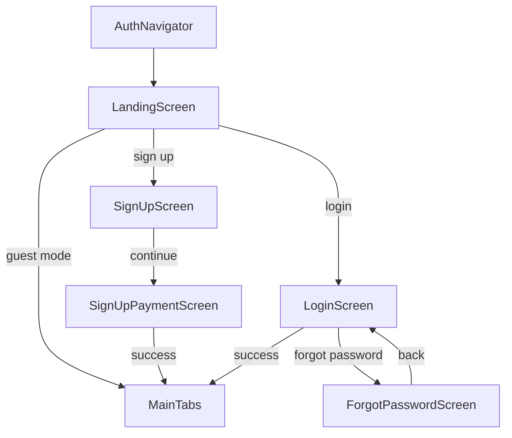

# AssignMint Screens Map

## Overview

This document provides a complete mapping of all screens, navigation flows, and routing in the AssignMint React Native frontend. It serves as the canonical reference for understanding how screens connect, their parameters, data sources, and user flows.

### Purpose
- **Single source of truth** for all navigation and screen information
- **Development reference** for understanding screen relationships and data flow
- **Validation target** for automated testing of navigation consistency
- **Onboarding guide** for new developers joining the project

### Maintenance
This document is automatically validated against the codebase using `npm run validate:screens`. Any discrepancies between this documentation and the actual code will cause CI failures.

### Validation Script
The `scripts/validate-screens-doc.js` script ensures:
- All routes in code are documented
- All documented routes exist in code
- Screen file paths match documentation
- Navigation parameters are consistent

## Global Navigation Structure

### Tab Navigation (Main App Flow)



### Auth Stack Navigation



### Full App Navigation Graph

```mermaid
graph TD
  Root[AppNavigator]
  Root --> Auth[AuthNavigator]
  Root --> MainTabs[MainTabs]
  
  %% Auth Flow
  Auth --> Landing[LandingScreen]
  Auth --> SignUp[SignUpScreen]
  Auth --> Login[LoginScreen]
  Auth --> SignUpPayment[SignUpPaymentScreen]
  Auth --> ForgotPassword[ForgotPasswordScreen]
  
  %% Main App Flow
  MainTabs --> Home[HomeScreen]
  MainTabs --> Post[PostTaskScreen/PostTeaserScreen]
  MainTabs --> Tasks[MyTasksScreen]
  MainTabs --> AI[AIAssistantScreen]
  MainTabs --> Profile[ProfileScreen]
  
  %% Task Related Screens
  Home -->|tap task| TaskDetails[TaskDetailsScreen]
  Tasks -->|tap task| TaskDetails
  TaskDetails -->|deliver| UploadDelivery[UploadDeliveryScreen]
  TaskDetails -->|chat| ChatThread[ChatThreadScreen]
  
  %% Post Task Flow
  Post -->|step 1| PostTask[PostTaskScreen]
  PostTask -->|step 5| TaskPostedConfirmation[TaskPostedConfirmation]
  
  %% Communication Screens
  Home -->|notifications| Notifications[NotificationsScreen]
  Home -->|messages| Messages[MessagesScreen]
  Messages -->|tap chat| ChatThread
  
  %% Profile & Settings
  Profile -->|settings| Settings[SettingsScreen]
  Settings -->|appearance| AppearanceSettings[AppearanceSettingsScreen]
  Settings -->|notifications| NotificationPreferences[NotificationPreferencesScreen]
  Settings -->|language| LanguageSelection[LanguageSelectionScreen]
  Settings -->|downloads| DownloadPreferences[DownloadPreferencesScreen]
  Settings -->|beta| BetaFeatures[BetaFeaturesScreen]
  Settings -->|payment| AddPaymentMethod[AddPaymentMethodScreen]
  Settings -->|support| ContactSupport[ContactSupportScreen]
  Settings -->|terms| TermsOfService[TermsOfServiceScreen]
  Settings -->|privacy| PrivacyPolicy[PrivacyPolicyScreen]
  
  %% Payment & Wallet
  Profile -->|wallet| Wallet[WalletScreen]
  Profile -->|payments| Payments[PaymentsScreen]
  Profile -->|analytics| Analytics[AnalyticsScreen]
  
  %% Development Screens
  Profile -->|icon test| IconTest[IconTestScreen]
  Profile -->|screen catalog| ScreenCatalog[ScreenCatalogScreen]
  Home -->|nav test| NavigationTest[NavigationTestScreen]
```



## Route Registry

| Route Name | File Path | Navigator | Params Type | Deep Link | Requires Auth | Test IDs |
|------------|-----------|-----------|-------------|-----------|---------------|----------|
| Landing | `src/screens/LandingScreen.tsx` | Auth | `undefined` | `assignmint://landing` | ❌ | `landing-screen` |
| SignUp | `src/screens/SignUpScreen.tsx` | Auth | `undefined` | `assignmint://signup` | ❌ | `signup-screen` |
| Login | `src/screens/LoginScreen.tsx` | Auth | `undefined` | `assignmint://login` | ❌ | `login-screen` |
| ForgotPassword | `src/screens/ForgotPasswordScreen.tsx` | Auth | `undefined` | `assignmint://forgot-password` | ❌ | `forgot-password-screen` |
| SignUpPayment | `src/screens/SignUpPaymentScreen.tsx` | Auth | `undefined` | `assignmint://signup-payment` | ❌ | `signup-payment-screen` |
| MainTabs | `src/navigation/AppTabs.tsx` | Root | `undefined` | `assignmint://main` | ✅ | `main-tabs` |
| Home | `src/screens/HomeScreen.tsx` | Tab | `undefined` | `assignmint://home` | ✅ | `home-screen` |
| Post | `src/screens/PostTaskScreen.tsx` | Tab | `undefined` | `assignmint://post` | ✅ | `post-screen` |
| Tasks | `src/screens/MyTasksScreen.tsx` | Tab | `undefined` | `assignmint://tasks` | ✅ | `tasks-screen` |
| AI | `src/screens/AIAssistantScreen.tsx` | Tab | `undefined` | `assignmint://ai` | ✅ | `ai-screen` |
| Profile | `src/screens/ProfileScreen.tsx` | Tab | `undefined` | `assignmint://profile` | ✅ | `profile-screen` |
| TaskDetails | `src/screens/TaskDetailsScreen.tsx` | Stack | `{ taskId: string; task?: any }` | `assignmint://task/:taskId` | ✅ | `task-details-screen` |
| TaskPostedConfirmation | `src/screens/TaskPostedConfirmation.tsx` | Stack | `{ taskTitle: string; budget: string; matchingPreference: string }` | `assignmint://task-confirmation` | ✅ | `task-confirmation-screen` |
| TaskAction | `src/screens/TaskActionScreen.tsx` | Stack | `undefined` | `assignmint://task-action` | ✅ | `task-action-screen` |
| UploadDelivery | `src/screens/UploadDeliveryScreen.tsx` | Stack | `{ taskId: string; task?: any }` | `assignmint://upload-delivery/:taskId` | ✅ | `upload-delivery-screen` |
| ChatThread | `src/screens/ChatThreadScreen.tsx` | Stack | `{ chat: { id: string; name: string; taskTitle: string } }` | `assignmint://chat/:chatId` | ✅ | `chat-thread-screen` |
| Messages | `src/screens/MessagesScreen.tsx` | Stack | `undefined` | `assignmint://messages` | ✅ | `messages-screen` |
| Notifications | `src/screens/NotificationsScreen.tsx` | Stack | `undefined` | `assignmint://notifications` | ✅ | `notifications-screen` |
| Settings | `src/screens/SettingsScreen.tsx` | Stack | `undefined` | `assignmint://settings` | ✅ | `settings-screen` |
| AppearanceSettings | `src/screens/AppearanceSettingsScreen.tsx` | Stack | `undefined` | `assignmint://settings/appearance` | ✅ | `appearance-settings-screen` |
| NotificationPreferences | `src/screens/NotificationPreferencesScreen.tsx` | Stack | `undefined` | `assignmint://settings/notifications` | ✅ | `notification-preferences-screen` |
| LanguageSelection | `src/screens/LanguageSelectionScreen.tsx` | Stack | `undefined` | `assignmint://settings/language` | ✅ | `language-selection-screen` |
| DownloadPreferences | `src/screens/DownloadPreferencesScreen.tsx` | Stack | `undefined` | `assignmint://settings/downloads` | ✅ | `download-preferences-screen` |
| BetaFeatures | `src/screens/BetaFeaturesScreen.tsx` | Stack | `undefined` | `assignmint://settings/beta` | ✅ | `beta-features-screen` |
| Payments | `src/screens/PaymentsScreen.tsx` | Stack | `undefined` | `assignmint://payments` | ✅ | `payments-screen` |
| AddPaymentMethod | `src/screens/AddPaymentMethodScreen.tsx` | Stack | `undefined` | `assignmint://payments/add` | ✅ | `add-payment-method-screen` |
| Wallet | `src/screens/WalletScreen.tsx` | Stack | `undefined` | `assignmint://wallet` | ✅ | `wallet-screen` |
| ContactSupport | `src/screens/ContactSupportScreen.tsx` | Stack | `undefined` | `assignmint://support` | ✅ | `contact-support-screen` |
| TermsOfService | `src/screens/TermsOfServiceScreen.tsx` | Stack | `undefined` | `assignmint://terms` | ✅ | `terms-of-service-screen` |
| PrivacyPolicy | `src/screens/PrivacyPolicyScreen.tsx` | Stack | `undefined` | `assignmint://privacy` | ✅ | `privacy-policy-screen` |
| AIAssistant | `src/screens/AIAssistantScreen.tsx` | Stack | `undefined` | `assignmint://ai-assistant` | ✅ | `ai-assistant-screen` |
| Analytics | `src/screens/AnalyticsScreen.tsx` | Stack | `undefined` | `assignmint://analytics` | ✅ | `analytics-screen` |
| IconTest | `src/screens/IconTestScreen.tsx` | Stack | `undefined` | `assignmint://icon-test` | ✅ | `icon-test-screen` |
| ScreenCatalog | `src/screens/ScreenCatalogScreen.tsx` | Stack | `undefined` | `assignmint://screen-catalog` | ✅ | `screen-catalog-screen` |
| NavigationTest | `src/screens/NavigationTestScreen.tsx` | Stack | `undefined` | `assignmint://navigation-test` | ✅ | `navigation-test-screen` |

*See [ROUTES_REGISTRY.md](./ROUTES_REGISTRY.md) for detailed parameter types and validation rules.*

## Screen Profiles

### LandingScreen (`Landing`)
**Path:** `src/screens/LandingScreen.tsx`  
**Navigator:** Auth Stack  
**Entry From:** App startup, deep link  
**Navigates To:** SignUp, Login, MainTabs (guest mode)  
**Params:** `undefined`  
**UI Ownership:** Landing hero, CTA buttons, brand elements  
**Back Behavior:** disabled (initial screen)  
**Data Source:** Mock - `src/api/__mocks__/auth.ts`  
**Events:** App launch, deep link handling, guest mode activation  
**Test IDs:** `landing-screen`, `signup-button`, `login-button`, `guest-button`  
**Edge Cases:** Network offline, app state restoration  
**Notes:** Entry point for all users, handles guest mode activation

### SignUpScreen (`SignUp`)
**Path:** `src/screens/SignUpScreen.tsx`  
**Navigator:** Auth Stack  
**Entry From:** LandingScreen, deep link  
**Navigates To:** SignUpPayment, Landing (back)  
**Params:** `undefined`  
**UI Ownership:** Registration form, validation messages, terms checkbox  
**Back Behavior:** default  
**Data Source:** Mock - `src/api/__mocks__/auth.ts`  
**Events:** Form validation, terms acceptance, registration submission  
**Test IDs:** `signup-screen`, `email-input`, `password-input`, `terms-checkbox`, `submit-button`  
**Edge Cases:** Invalid email, weak password, terms not accepted, network error  
**Notes:** Validates email format and password strength before proceeding

### LoginScreen (`Login`)
**Path:** `src/screens/LoginScreen.tsx`  
**Navigator:** Auth Stack  
**Entry From:** LandingScreen, deep link  
**Navigates To:** MainTabs (success), ForgotPassword, Landing (back)  
**Params:** `undefined`  
**UI Ownership:** Login form, social login buttons, forgot password link  
**Back Behavior:** default  
**Data Source:** Mock - `src/api/__mocks__/auth.ts`  
**Events:** Login submission, social login, forgot password navigation  
**Test IDs:** `login-screen`, `email-input`, `password-input`, `login-button`, `forgot-password-link`  
**Edge Cases:** Invalid credentials, network error, account locked  
**Notes:** Supports social login and password reset flow

### HomeScreen (`Home`)
**Path:** `src/screens/HomeScreen.tsx`  
**Navigator:** Tab  
**Entry From:** MainTabs, deep link  
**Navigates To:** TaskDetails, ChatThread, Notifications, Messages, NavigationTest  
**Params:** `undefined`  
**UI Ownership:** Task feed, search bar, notification icons, task cards  
**Back Behavior:** disabled (tab screen)  
**Data Source:** Mock - `src/api/__mocks__/tasks.ts`, `src/api/__mocks__/notifications.ts`  
**Events:** Task interaction, search, notification tap, message tap  
**Test IDs:** `home-screen`, `search-input`, `notification-button`, `message-button`, `task-card`  
**Edge Cases:** Empty feed, search no results, network error  
**Notes:** Main feed screen with real-time task updates

### PostTaskScreen (`Post`)
**Path:** `src/screens/PostTaskScreen.tsx`  
**Navigator:** Tab  
**Entry From:** MainTabs, deep link  
**Navigates To:** TaskPostedConfirmation (success), back to MainTabs  
**Params:** `undefined`  
**UI Ownership:** Multi-step wizard, form components, progress indicator  
**Back Behavior:** custom (step navigation)  
**Data Source:** Mock - `src/api/__mocks__/tasks.ts`  
**Events:** Step navigation, form validation, task submission  
**Test IDs:** `post-task-screen`, `step-indicator`, `form-inputs`, `submit-button`  
**Edge Cases:** Form validation errors, network timeout, incomplete data  
**Notes:** Multi-step wizard with conditional rendering based on user state

### MyTasksScreen (`Tasks`)
**Path:** `src/screens/MyTasksScreen.tsx`  
**Navigator:** Tab  
**Entry From:** MainTabs, deep link  
**Navigates To:** TaskDetails, UploadDelivery, ChatThread  
**Params:** `undefined`  
**UI Ownership:** Task list, status filters, empty state  
**Back Behavior:** disabled (tab screen)  
**Data Source:** Mock - `src/api/__mocks__/tasks.ts`  
**Events:** Task selection, status filtering, refresh  
**Test IDs:** `tasks-screen`, `task-item`, `status-filter`, `empty-state`  
**Edge Cases:** No tasks, network error, loading state  
**Notes:** Shows user's assigned and posted tasks with filtering

### AIAssistantScreen (`AI`)
**Path:** `src/screens/AIAssistantScreen.tsx`  
**Navigator:** Tab  
**Entry From:** MainTabs, deep link  
**Navigates To:** TaskDetails (from AI suggestions)  
**Params:** `undefined`  
**UI Ownership:** Chat interface, AI responses, suggestion cards  
**Back Behavior:** disabled (tab screen)  
**Data Source:** Mock - `src/api/__mocks__/ai.ts`  
**Events:** Message sending, AI response, suggestion selection  
**Test IDs:** `ai-screen`, `chat-input`, `ai-response`, `suggestion-card`  
**Edge Cases:** AI unavailable, network error, empty chat  
**Notes:** AI-powered task assistance and recommendations

### ProfileScreen (`Profile`)
**Path:** `src/screens/ProfileScreen.tsx`  
**Navigator:** Tab  
**Entry From:** MainTabs, deep link  
**Navigates To:** Settings, Wallet, Analytics, ContactSupport, TermsOfService, PrivacyPolicy, Payments, IconTest, ScreenCatalog  
**Params:** `undefined`  
**UI Ownership:** User info, stats, menu items, mode toggle  
**Back Behavior:** disabled (tab screen)  
**Data Source:** Mock - `src/api/__mocks__/user.ts`, `src/api/__mocks__/analytics.ts`  
**Events:** Profile update, mode switching, menu navigation  
**Test IDs:** `profile-screen`, `user-info`, `stats-section`, `menu-item`  
**Edge Cases:** No profile data, network error, guest mode  
**Notes:** Central hub for user settings and account management

### TaskDetailsScreen (`TaskDetails`)
**Path:** `src/screens/TaskDetailsScreen.tsx`  
**Navigator:** Stack  
**Entry From:** HomeScreen, MyTasksScreen, AIAssistantScreen  
**Navigates To:** UploadDelivery, ChatThread, MyTasks (back)  
**Params:** `{ taskId: string; task?: any }`  
**UI Ownership:** Task details, action buttons, status indicators  
**Back Behavior:** default  
**Data Source:** Mock - `src/api/__mocks__/tasks.ts`  
**Events:** Task actions, delivery upload, chat initiation  
**Test IDs:** `task-details-screen`, `task-info`, `action-button`, `status-indicator`  
**Edge Cases:** Task not found, network error, permission denied  
**Notes:** Detailed view with task-specific actions and status

### TaskPostedConfirmation (`TaskPostedConfirmation`)
**Path:** `src/screens/TaskPostedConfirmation.tsx`  
**Navigator:** Stack  
**Entry From:** PostTaskScreen (step 5)  
**Navigates To:** TaskDetails, MainTabs  
**Params:** `{ taskTitle: string; budget: string; matchingPreference: string }`  
**Back Behavior:** custom (success flow)  
**Data Source:** Mock - `src/api/__mocks__/tasks.ts`  
**Events:** Success confirmation, task management navigation  
**Test IDs:** `task-confirmation-screen`, `success-message`, `view-task-button`  
**Edge Cases:** Missing task data, network error  
**Notes:** Success screen after task posting with next action options

### ChatThreadScreen (`ChatThread`)
**Path:** `src/screens/ChatThreadScreen.tsx`  
**Navigator:** Stack  
**Entry From:** HomeScreen, MyTasksScreen, TaskDetailsScreen, MessagesScreen  
**Navigates To:** TaskDetails (from chat)  
**Params:** `{ chat: { id: string; name: string; taskTitle: string } }`  
**UI Ownership:** Chat messages, input field, typing indicators  
**Back Behavior:** default  
**Data Source:** Mock - `src/api/__mocks__/chat.ts`  
**Events:** Message sending, typing indicators, task navigation  
**Test IDs:** `chat-thread-screen`, `message-list`, `chat-input`, `send-button`  
**Edge Cases:** No messages, network error, user offline  
**Notes:** Real-time chat with task context and navigation

### MessagesScreen (`Messages`)
**Path:** `src/screens/MessagesScreen.tsx`  
**Navigator:** Stack  
**Entry From:** HomeScreen, deep link  
**Navigates To:** ChatThread  
**Params:** `undefined`  
**UI Ownership:** Message list, conversation previews, unread indicators  
**Back Behavior:** default  
**Data Source:** Mock - `src/api/__mocks__/chat.ts`  
**Events:** Conversation selection, message reading  
**Test IDs:** `messages-screen`, `conversation-item`, `unread-indicator`  
**Edge Cases:** No conversations, network error  
**Notes:** Central messaging hub with conversation management

### NotificationsScreen (`Notifications`)
**Path:** `src/screens/NotificationsScreen.tsx`  
**Navigator:** Stack  
**Entry From:** HomeScreen, deep link  
**Navigates To:** TaskDetails (from notification)  
**Params:** `undefined`  
**UI Ownership:** Notification list, read/unread states, action buttons  
**Back Behavior:** default  
**Data Source:** Mock - `src/api/__mocks__/notifications.ts`  
**Events:** Notification reading, action execution  
**Test IDs:** `notifications-screen`, `notification-item`, `read-button`  
**Edge Cases:** No notifications, network error  
**Notes:** Notification center with task-related actions

### SettingsScreen (`Settings`)
**Path:** `src/screens/SettingsScreen.tsx`  
**Navigator:** Stack  
**Entry From:** ProfileScreen  
**Navigates To:** AppearanceSettings, NotificationPreferences, LanguageSelection, DownloadPreferences, BetaFeatures, AddPaymentMethod, ContactSupport, TermsOfService, PrivacyPolicy  
**Params:** `undefined`  
**UI Ownership:** Settings menu, category sections, toggles  
**Back Behavior:** default  
**Data Source:** Mock - `src/api/__mocks__/settings.ts`  
**Events:** Setting changes, menu navigation  
**Test IDs:** `settings-screen`, `setting-item`, `toggle-switch`  
**Edge Cases:** Settings sync error, network offline  
**Notes:** Central settings hub with categorized options

### UploadDeliveryScreen (`UploadDelivery`)
**Path:** `src/screens/UploadDeliveryScreen.tsx`  
**Navigator:** Stack  
**Entry From:** TaskDetailsScreen  
**Navigates To:** TaskDetails (success)  
**Params:** `{ taskId: string; task?: any }`  
**UI Ownership:** File upload, progress indicator, submission form  
**Back Behavior:** default  
**Data Source:** Mock - `src/api/__mocks__/tasks.ts`  
**Events:** File selection, upload progress, submission  
**Test IDs:** `upload-delivery-screen`, `file-picker`, `upload-progress`, `submit-button`  
**Edge Cases:** File too large, network error, invalid file type  
**Notes:** Task delivery submission with file upload support

### NavigationTestScreen (`NavigationTest`)
**Path:** `src/screens/NavigationTestScreen.tsx`  
**Navigator:** Stack  
**Entry From:** HomeScreen (development only)  
**Navigates To:** All screens (for testing)  
**Params:** `undefined`  
**UI Ownership:** Test buttons, navigation validation  
**Back Behavior:** default  
**Data Source:** None (test only)  
**Events:** Navigation testing, validation alerts  
**Test IDs:** `navigation-test-screen`, `test-button`  
**Edge Cases:** Invalid routes, navigation errors  
**Notes:** Development tool for testing all navigation routes

## Modals / Sheets

Currently, AssignMint uses stack navigation for all screens. No modal or bottom sheet components are implemented in the current version.

### Future Modal/Sheet Considerations
- **Task Action Modal**: Quick actions for task management
- **Image Preview Modal**: Full-screen image viewing
- **Payment Method Sheet**: Bottom sheet for payment selection
- **Filter Sheet**: Bottom sheet for task filtering options

## Global Conventions

### Navigation Naming
- **Route Names**: PascalCase (e.g., `TaskDetails`, `SignUpPayment`)
- **File Names**: PascalCase with Screen suffix (e.g., `TaskDetailsScreen.tsx`)
- **Constants**: UPPER_SNAKE_CASE (e.g., `TASK_DETAILS`)

### Route Parameter Typing
```typescript
// Standard parameter interface
interface TaskDetailsParams {
  taskId: string;
  task?: any;
}

// Optional parameters
interface ChatThreadParams {
  chat: {
    id: string;
    name: string;
    taskTitle: string;
  };
}
```

### Header/Back Button Rules
- **Tab Screens**: No back button (disabled)
- **Stack Screens**: Default back button unless custom behavior
- **Auth Screens**: Custom back behavior for flow control
- **Development Screens**: Standard back button

### Theming Tokens
```typescript
// Colors
COLORS.primary    // Primary brand color
COLORS.secondary  // Secondary actions
COLORS.text       // Primary text
COLORS.textSecondary // Secondary text
COLORS.background // Screen background
COLORS.surface    // Card/surface background
COLORS.border     // Borders and dividers

// Typography
FONTS.heading     // Screen titles
FONTS.body        // Body text
FONTS.caption     // Captions and labels
```

### Error Handling
- **Toast Messages**: For user feedback
- **Alert Dialogs**: For critical errors
- **Loading States**: During data fetching
- **Retry Mechanisms**: For network failures

### Loading Indicators
- **Screen Loading**: Full-screen spinner
- **Button Loading**: Disabled state with spinner
- **List Loading**: Skeleton screens
- **Image Loading**: Placeholder with spinner

## How to Update

### Adding a New Screen

1. **Create the screen file** in `src/screens/`
2. **Add to navigation** in appropriate navigator
3. **Update type definitions** in `src/types/navigation.ts`
4. **Add to this documentation** following the screen profile template
5. **Run validation**: `npm run validate:screens`

### Renaming a Screen

1. **Rename the file** and update imports
2. **Update route name** in navigator
3. **Update type definitions** in navigation types
4. **Update this documentation** with new name
5. **Run validation**: `npm run validate:screens`

### Adding Navigation Parameters

1. **Update TypeScript interface** in navigation types
2. **Update screen component** to handle new params
3. **Update this documentation** with new param types
4. **Run validation**: `npm run validate:screens`

### Pre-commit Hook

Add to your pre-commit configuration:
```bash
# .husky/pre-commit
npm run validate:screens
```

This ensures navigation documentation stays in sync with code changes.
